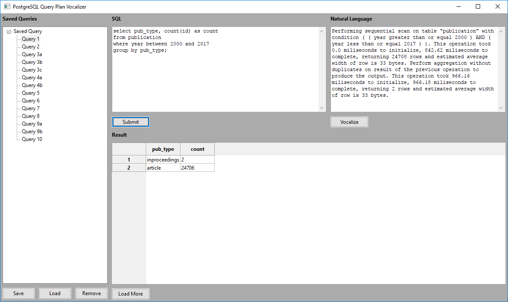

# qELI5 - PostgreSQL Query Plan Vocalizer


A Python native application providing detailed descriptions in natural language of a PostgreSQL execution plan for any SQL query, equipped with Text-to-Speech capability.

------
## I. Setup
### 1. Dependencies
#### ❏ pip (Python)
Required packages for implemented functionalities.
##### Listing
```bash
wxPython         # Python API for building wxWidget app
psycopg2         # Connector for PostgreSQL
ply              # Python API for parsing tools lex and yacc
python-dotenv    # Environment variable populator for .env file
gtts             # Google Text-to-Speed module
playsound        # Cross-platform sound file player
```
##### Installation steps
1. Get `pip` at https://pip.pypa.io/en/stable/installing/.

2. Run one of the following command to install all mentioned packages.
```bash
pip install -r requirements.txt     # Windows
pip3 install -r requirements.txt    # Mac/Linux
```
#### ❏ npm (Node.js, JavaScript)
Development dependencies which help speed up the development process.
##### Listing
```bash
yarn (global)    # for managing npm dependencies & starting npm scripts
nodemon          # for hot-reloading
run-script-os    # for multiplexing platform-specific npm scripts
```
##### Installation steps
1. Get `npm` as a part of Node.js at https://nodejs.org/en/download/.

2. Run `npm i -g yarn` to install yarn globally. (optional)

3. Run `yarn` (or `npm install`, if you skipped step 2) to install all mentioned packages.

### 2. Environment Variables
Environment variable setup mechanism is provided by the `dotenv` package, which populates the workspace with configurations declared in `.env`.
```
DB_NAME = <db_name>
DB_HOST = <db_host>
DB_USER = <db_user>
DB_PWD  = <db_password>
```
Actual configurations varies between systems and developer's choices (local/cloud). Rename `.env.example` to `.env` and modify values accordingly.

Below is a sample `.env` file.
```
DB_NAME = db_proj2
DB_HOST = localhost
DB_USER = postgres
DB_PWD  = 123456
```

------
## II. Run
### 1. With hot-reload
Run one of the following command to start.
```bash
yarn         # with yarn
npm start    # without yarn
```
For more details on using `nodemon` as a hot-reloader, refer to https://github.com/remy/nodemon.
### 2. Without  hot-reload
Run one of the following command to start.
```bash
python main.py     # Windows
python3 main.py    # Mac/Linux
```